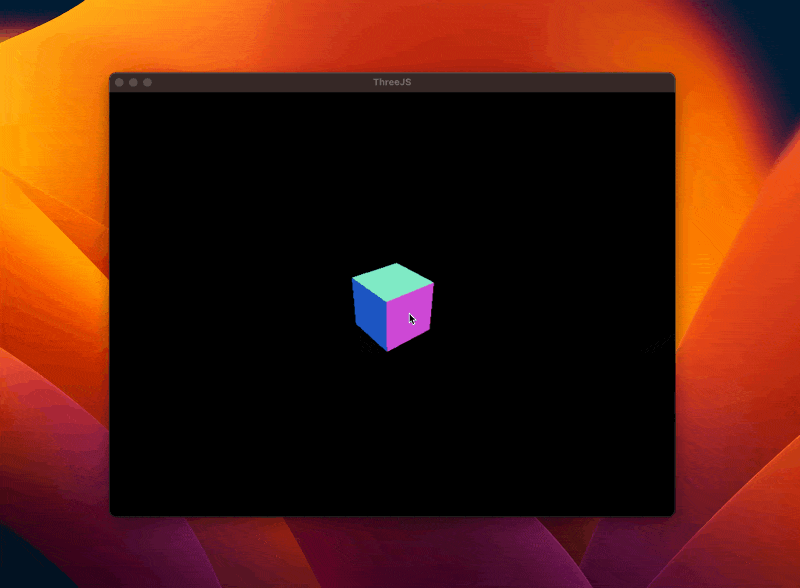

# deno_webgpu_canvas

The goal of this project is to experiment how to run a THREE.JS project outside a browser.

- Window creation is handled by SDL2
- [deno_sdl2](https://github.com/littledivy/deno_sdl2) exposes a `Deno.UnsafeWindowSurface` to create a [GPUCanvasContext](https://developer.mozilla.org/en-US/docs/Web/API/GPUCanvasContext)
- Browser events like [MouseEvent](https://developer.mozilla.org/en-US/docs/Web/API/MouseEvent), [WheelEvent](https://developer.mozilla.org/en-US/docs/Web/API/WheelEvent) and [KeyboardEvent](https://developer.mozilla.org/en-US/docs/Web/API/MouseEvent) are mapped to SDL2 events

```ts
import {
  BoxGeometry,
  Mesh,
  Scene,
  MeshNormalMaterial,
  PerspectiveCamera,
} from "https://esm.sh/three";
import WebGPURenderer from "https://esm.sh/three/addons/renderers/webgpu/WebGPURenderer.js";
import { OrbitControls } from "https://esm.sh/three/addons/controls/OrbitControls.js";
import { WebGPUCanvas } from "deno_webgpu_canvas/mod.ts";

const title = "ThreeJS";
const width = 800;
const height = 600;

const canvas = new WebGPUCanvas({ title, width, height });

const renderer = new WebGPURenderer({ canvas });
await renderer.init();
renderer.setSize(width, height, false);

const scene = new Scene();
const camera = new PerspectiveCamera(75, 800 / 600, 0.1, 1000);
camera.updateProjectionMatrix();
camera.position.z = 5;

const controls = new OrbitControls(camera, canvas);

const cube = new Mesh(new BoxGeometry(1, 1, 1), new MeshNormalMaterial());
scene.add(cube);

canvas.addEventListener("draw", () => {
  controls.update();
  renderer.render(scene, camera);
});
```


